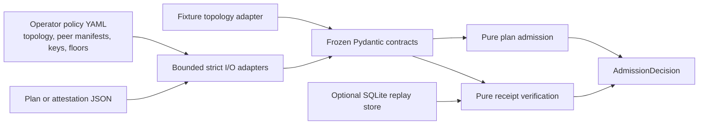

# LocusMesh

LocusMesh is a local-first, fail-closed Python library and CLI for evaluating
distributed-inference execution scopes and verifying signed route evidence.

It answers two bounded questions:

1. Is an operator-pinned route plan admissible under `device_only`,
   `private_mesh`, or `public_mesh` policy?
2. Does a route attestation contain one valid Ed25519-signed receipt for every
   exact hop?

It does not select a model, route a prompt, call an inference endpoint, or run
an agent.

## Status

| Property | Status |
| --- | --- |
| Version | `0.1.0a1` |
| Maturity | Experimental executable alpha; not production-ready |
| Runtime mode | Offline vertical slice over supplied artifacts |
| License | [Apache-2.0](LICENSE) |

The current release provides:

- strict Pydantic contracts and deterministic JSON Schema export;
- bounded JSON/YAML input with duplicate-key rejection;
- pure route-plan admission with explicit verification time in the library;
- direct Ed25519 signatures over compact, sorted-key UTF-8 JSON payloads;
- full hop-chain, digest, key, scope, time, and evidence checks;
- a strict local fixture topology adapter;
- optional SQLite replay protection after successful verification;
- an offline CLI, deterministic demo scenarios, and Python API.

The CLI and library operate on supplied files and objects. They are not a fresh
pre-invocation runtime attestor and do not enable a live mesh adapter.

## Install for local development

```bash
uv sync --dev
uv run locusmesh --json doctor
```

Python 3.12 or newer is required.

## CLI

`--json` is a global option and must precede the subcommand.

```bash
uv run locusmesh --json doctor
uv run locusmesh --json probe --topology topology.json
uv run locusmesh --json admit --policy policy.yaml --plan plan.json
uv run locusmesh --json verify \
  --policy policy.yaml \
  --attestation attestation.json
uv run locusmesh --json verify \
  --policy policy.yaml \
  --attestation attestation.json \
  --nonce-store .local/locusmesh-replay.sqlite3
uv run locusmesh --json demo
uv run locusmesh --json schema export --out generated-schemas
```

| Exit | Meaning |
| --- | --- |
| `0` | Command succeeded or the decision admitted the route. |
| `1` | Redacted internal failure; no admission was granted. |
| `2` | Input, schema, file, decoding, or configured-state error. |
| `3` | Route-plan policy denial. |
| `4` | Attestation, signature, evidence, time, or replay denial. |

JSON mode emits a stable `locusmesh.cli-output.v1` envelope on stdout.
Handled internal failures use `INTERNAL_ERROR`, `ok=false`, and `data=null`
without exposing exception details. Diagnostics use stderr. A process failure
outside the CLI boundary yields no valid admission and is also a denial.

## Scope model

The route intent is the maximum permitted boundary:

```text
device_only < private_mesh < public_mesh
```

| Scope | Current admission rule |
| --- | --- |
| `device_only` | Exactly one hop, and it must equal the topology's operator-pinned `local_peer_id`. |
| `private_mesh` | Local and private peers are allowed when pinned in policy; public peers widen scope and are denied. |
| `public_mesh` | Public peers are allowed only when `public_mesh` is explicitly allowed by policy. No confidentiality follows from this scope. |

Every adjacent pair in a multi-hop plan must appear as a directed topology
edge. Duplicate peers, unknown peers, excessive hop count, stale artifacts,
model/runtime mismatches, or key-binding errors deny admission.

A loopback address is only an `address_hint`. It grants no locality.

## Evidence model

```text
observed < peer_asserted < hardware_attested
```

| Level | Meaning in the current code |
| --- | --- |
| `observed` | A low-strength claim that may satisfy only an explicit operator policy floor. It does not authenticate locality or compute. |
| `peer_asserted` | A peer receipt whose canonical payload verifies against the Ed25519 key pinned in the policy topology. It proves signer provenance and payload integrity only. |
| `hardware_attested` | Reserved vocabulary. The current verifier caps it to effective `peer_asserted` and denies policies that require hardware attestation. |

`AdmissionDecision` reports required and effective evidence separately.
A signature does not prove that a peer ran the claimed model, performed the
computation correctly, or kept content confidential.

## Architecture



The pure policy and verification functions receive time explicitly. File I/O,
the current wall clock, fixture loading, local signing, and replay persistence
remain at adapter boundaries.

### Modules

| Module | Responsibility |
| --- | --- |
| `models.py` | Frozen, strict, versioned Pydantic wire contracts. |
| `policy.py` | Topology/policy digests and fail-closed plan admission. |
| `attestation.py` | Fixture receipt construction and exact attestation verification. |
| `canonical.py` | Compact sorted-key JSON bytes, SHA-256 digests, and keyed request commitments. |
| `crypto.py` | Canonical base64url handling, key identifiers, and Ed25519 verification. |
| `io.py` | One-MiB bounded JSON/YAML parsing with duplicate-key rejection. |
| `ports.py` | Provider-neutral topology, signer, and replay protocols. |
| `adapters/fixture.py` | Strict local JSON topology source. |
| `adapters/local_signer.py` | In-memory Ed25519 signer for fixtures and embedding. |
| `replay.py` | Optional lazy SQLite nonce store. |
| `schema_export.py` | Deterministic Pydantic JSON Schema export. |
| `cli.py` | Offline command surface and stable JSON envelope. |

## Current contracts

- `ExecutionIntent`
- `EvidenceLevel`
- `PeerManifest`
- `TopologyEdge`
- `TopologySnapshot`
- `RoutePlan`
- `HopReceipt`
- `RouteAttestation`
- `AdmissionPolicy`
- `AdmissionDecision`

`AdmissionPolicy` is the operator-pinned policy bundle. It contains the
topology snapshot, `local_peer_id`, peer manifests, Ed25519 public keys,
scope classifications, model/runtime digests, evidence floors, and hop limit.

A provider observation does not become authority merely by matching this
shape. An operator must pin and review the policy file used for admission.

## Receipt binding

Each `HopReceipt` directly signs its complete payload except `signature`. The
payload binds:

- request ID, nonce, and keyed request commitment;
- route-plan, policy, and topology digests;
- requested intent;
- exact hop index and count;
- peer, previous peer, next peer, and previous receipt digest;
- model and runtime digests;
- claimed evidence level and observation time;
- key identifier and signature algorithm.

The verifier derives `key_id` as SHA-256 over the raw Ed25519 public key,
checks the policy-pinned binding, verifies the signature, enforces plan,
topology, and manifest time windows, and requires monotonic receipt time.

The current format is a LocusMesh Pydantic contract with a direct Ed25519
signature. It is **not** DSSE, in-toto, or RFC 8785 canonical JSON.

## Request commitments

`commit_request` creates:

```text
hmac-sha256:<hex digest>
```

over compact sorted-key JSON and requires a key of at least 32 bytes. Receipts
carry only the commitment. Raw prompts, completions, and commitment keys do not
belong in route artifacts.

## Replay behavior

Without `--nonce-store`, verification is stateless.

With `--nonce-store FILE`, a lazy SQLite store atomically records the nonce,
request commitment, and attestation digest only after the complete attestation
has verified. Reusing the nonce then denies with `REPLAY_DETECTED`.

The store is local state, not a distributed replay authority.

## Demo

```bash
uv run locusmesh --json demo
```

The demo runs five offline scenarios:

- device-local route admitted;
- two-hop private route admitted;
- loopback-addressed public peer denied under `device_only`;
- tampered signature denied;
- first replay-store verification admitted and the second denied.

## Python API

```python
from datetime import UTC, datetime
from pathlib import Path

from locusmesh.attestation import verify_attestation
from locusmesh.io import load_json_model, load_yaml_model
from locusmesh.models import RouteAttestation
from locusmesh.policy import AdmissionPolicy

policy = load_yaml_model(Path("policy.yaml"), AdmissionPolicy)
attestation = load_json_model(Path("attestation.json"), RouteAttestation)
assert isinstance(policy, AdmissionPolicy)
assert isinstance(attestation, RouteAttestation)

decision = verify_attestation(
    attestation,
    policy,
    now=datetime.now(tz=UTC),
)
```

The public module surfaces also include `admit_plan`, `policy_digest`,
`topology_digest`, `build_attestation`, `commit_request`, `sha256_digest`,
`FixtureTopologyProvider`, `LocalEd25519Signer`, and `SQLiteReplayStore`.

## Security truth

The alpha establishes deterministic policy and signed-claim checks over supplied
artifacts. It does not establish:

- correct inference or correct model execution;
- hidden-hop absence beyond the pinned route;
- physical, jurisdictional, or network locality;
- prompt, completion, weight, or traffic confidentiality;
- runtime integrity or TEE state;
- fresh pre-invocation admission;
- IAM identity or online key revocation;
- safety of a future OpenAI-compatible proxy;
- availability, latency, price, or answer quality.

See the [threat model](docs/threat-model.md).

## Out of scope for `v0.1`

- OpenAI-compatible proxy;
- real Mesh-LLM adapter;
- live topology discovery or reservation;
- IAM and secret-manager integration;
- TEE verification;
- proof of correct compute;
- provider routing and model capability selection.

DSSE, in-toto predicates, and RFC 8785 may be evaluated as future
interoperability standards. They are not current implementation claims.

## Verification

```bash
uv lock --check
uv run ruff format --check .
uv run ruff check .
uv run mypy src tests
uv run pytest
uv export --locked --all-groups --no-emit-project --no-hashes \
  --output-file /tmp/locusmesh-audit-requirements.txt
uv run pip-audit --strict \
  --requirement /tmp/locusmesh-audit-requirements.txt
uv build --no-build-isolation
uv run locusmesh --json doctor
uv run locusmesh --json demo
```

The release contract and mandatory cases are documented in
[docs/delivery-contract.md](docs/delivery-contract.md).

## Design documents

- [Delivery contract](docs/delivery-contract.md)
- [Admission/evidence boundary ADR](docs/adr/0001-admission-evidence-boundary.md)
- [Threat model](docs/threat-model.md)
- [Runbook](docs/runbook.md)
- [Primary-source market scan](docs/market-scan.md)
- [Changelog](CHANGELOG.md)

## License

[Apache License 2.0](LICENSE) (`Apache-2.0`).
