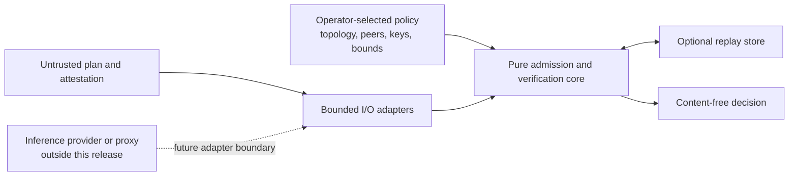

# ADR 0001: Separate route admission from inference execution

- **Status:** Accepted
- **Date:** 2026-07-19
- **Applies to:** LocusMesh `0.1.0a1`

## Context

An application can call an OpenAI-compatible endpoint on loopback while that
endpoint forwards work to another device, splits a model across peers, or joins
a public fabric. The first transport address therefore does not prove where a
request is executed.

The first useful product slice must answer a narrower question:

> Given an operator-selected policy, a proposed route, and a signed receipt for
> every declared hop, is the supplied offline bundle internally consistent and
> admissible?

It must not imply that the route is fresh, reserved, executed, confidential, or
correct. Building a proxy before those semantics exist would combine the data
plane with a trust decision that the evidence cannot support.

## Decision

LocusMesh is an executable offline admission and signed route-evidence library
with a CLI, a Python API, strict Pydantic contracts, a fixture topology adapter,
and an optional SQLite replay adapter.

It does not execute or proxy inference.

### 1. The domain core is explicit and deterministic

The policy and attestation functions consume immutable typed values. The
verification time is an explicit library argument. They do not read files,
call a network, consult environment variables, or obtain a wall clock.

Adapters own effects:

- the CLI supplies current UTC time;
- JSON and YAML loaders enforce bounded, duplicate-free input;
- the fixture adapter reads a topology snapshot;
- the local Ed25519 signer supports fixtures and local embedding;
- the SQLite adapter provides optional cross-run nonce state;
- schema export writes the public JSON Schemas.

### 2. The selected policy is the authority root

`AdmissionPolicy` embeds the operator-pinned topology snapshot. That snapshot
contains:

- the local peer identifier;
- directed execution edges;
- peer execution-scope classifications;
- model and runtime digests;
- evidence ceilings;
- Ed25519 public keys and derived key identifiers;
- validity windows.

`admit` and `verify` accept this policy explicitly. The `probe` command only
describes a fixture topology; it cannot mutate, generate, or authorize a
policy. Provider observations and receipt fields cannot add peers, edges,
keys, or scope authority.

Selecting the correct policy file remains an operator responsibility in this
offline slice.

### 3. Scope is a maximum, never an endpoint inference

The ordered scopes are:

```text
device_only < private_mesh < public_mesh
```

A route may remain narrower than its requested intent, but no peer may exceed
that intent. `device_only` is stricter: it requires exactly one hop, and that
hop must equal the policy topology's `local_peer_id`. Loopback addresses and
`address_hint` values have no authority.

The route must also use known peers, declared directed edges, permitted
intents, matching model/runtime digests, valid time windows, unique peers, and
no more than the configured hop limit.

### 4. Receipts are direct, narrowly profiled signatures

Each `HopReceipt` is signed directly with Ed25519 over compact UTF-8 JSON
produced with sorted object keys, no insignificant whitespace, and non-finite
numbers rejected. SHA-256 provides typed digests. Public keys and signatures
use canonical unpadded base64url; the key identifier is the SHA-256 digest of
the raw Ed25519 public key.

This is the current LocusMesh profile. It is deliberately not described as
RFC 8785 canonical JSON, DSSE, or an in-toto statement. Those standards may be
evaluated for a future interoperability profile without changing the meaning
of the current wire format.

### 5. Every declared hop is exactly bound

The attestation contains the route plan and an ordered receipt tuple. The
verifier requires one receipt per planned hop. Every receipt binds:

- request identifier, nonce, and HMAC-SHA-256 request commitment;
- route-plan, policy, and topology digests;
- requested intent;
- exact hop index and total count;
- current, previous, and next peer identifiers;
- digest of the previous complete receipt;
- model and runtime digests;
- claimed evidence level and observation time;
- signing key identifier and algorithm.

The verifier recomputes all expected values from the selected plan and policy.
Missing, surplus, reordered, spliced, stale, future, or modified receipts are
denied.

### 6. Evidence levels describe support, not truth

The public vocabulary is:

- `observed`;
- `peer_asserted`;
- `hardware_attested`.

A valid Ed25519 signature authenticates the statement to a policy-pinned key.
It does not prove physical locality, correct compute, confidentiality, loaded
artifacts, or absence of hidden forwarding.

`0.1.0a1` has no hardware-attestation verifier. A
`hardware_attested` claim is capped to effective `peer_asserted` evidence, and
a policy that requires hardware-attested evidence is denied explicitly.

### 7. Request content stays outside the contract

The route plan carries a caller-produced `hmac-sha256:...` commitment. The
library helper requires a key of at least 32 bytes, but verification consumes
only the commitment. Prompts, completions, commitment keys, private signing
keys, tokens, and credentials are not admission inputs.

### 8. Replay state is optional and applied last

The pure verifier can validate a bundle without state, but that cannot prevent
cross-run replay. When a `ReplayStore` is supplied, the verifier records the
nonce, request commitment, and attestation digest atomically only after every
policy, binding, time, evidence, and signature check passes. A repeated nonce
is denied.

The CLI implementation uses an optional SQLite file. Omitting it is an
explicitly weaker replay mode.

## Resulting boundary



## Consequences

### Benefits

- Route policy is independent of a provider or orchestration framework.
- The decision is reproducible when all explicit inputs, including time, are
  fixed.
- Provider output cannot self-authorize a peer or key.
- The receipt chain detects modification and inconsistency across declared
  hops.
- The same core can be embedded behind a CLI, API, or future provider adapter.
- Negative cases can be tested without a network or model runtime.

### Costs and limitations

- No live route is reserved or enforced.
- A valid report says nothing about a later invocation.
- A malicious but policy-allowed signer can make a coherent false assertion.
- Hidden hops cannot be discovered from a declared offline chain.
- Static policy does not provide online key revocation or policy freshness.
- Cross-run replay protection needs writable state.
- The current deterministic JSON profile is LocusMesh-specific.
- A live integration will require a preflight/reservation protocol and fresh
  post-execution evidence, not only an HTTP adapter.

## Alternatives considered

### Start with an OpenAI-compatible proxy

Rejected for this slice. A proxy would create an enforcement impression before
fresh route reservation, live observation, and complete evidence exist.

### Trust provider topology or a loopback endpoint

Rejected. Provider data is useful observation, but neither it nor loopback is
independent locality evidence.

### Allow receipts to carry keys or decisions

Rejected. A self-supplied key or `admitted=true` field would let evidence grant
its own authority. Keys come from the selected policy, and decisions are always
recomputed.

### Implement identity, secrets, or hardware attestation in core

Rejected for the first slice. Mature systems should be integrated through
adapters, and hardware evidence requires a separate verifier, roots, threat
model, and deployment assumptions.

### Adopt a general attestation envelope immediately

Deferred. in-toto, DSSE, and RFC 8785 are useful interoperability candidates,
but claiming them without implementing their exact profiles would be unsafe.
The current direct Ed25519 format is smaller and fully testable.

## Follow-up ADRs required

A new decision record is required before adding any of:

- a live distributed-inference adapter;
- an OpenAI-compatible proxy;
- route reservation or two-phase admission;
- remote replay or revocation state;
- workload identity or secret-manager integration;
- an interoperable attestation envelope/canonicalization profile;
- a hardware-attestation verifier;
- proof of correct compute or confidentiality claims;
- production `public_mesh` enablement.

## Validation

The mandatory cases are defined in
[the delivery contract](../delivery-contract.md). The release must at least
prove:

- exact local and private routes can be admitted;
- a loopback-labeled public peer cannot satisfy `device_only`;
- unknown peers, undeclared edges, duplicate peers, digest mismatch, expiry,
  key mismatch, and insufficient evidence deny;
- receipt tampering, reordering, missing/surplus receipts, and chain splicing
  deny;
- hardware evidence is never overclaimed;
- invalid evidence does not write replay state;
- a second valid use of a persisted nonce denies;
- the CLI works offline and exports its schemas.

## References

- [Mesh-LLM](https://github.com/Mesh-LLM/mesh-llm)
- [in-toto Attestation Framework](https://github.com/in-toto/attestation)
- [DSSE](https://github.com/secure-systems-lab/dsse)
- [RFC 8785](https://www.rfc-editor.org/rfc/rfc8785)
