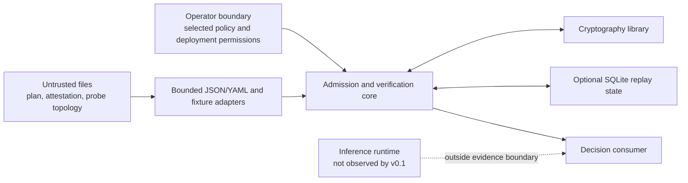

# LocusMesh `0.1` threat model

## 1. Scope and security objective

LocusMesh protects the integrity of an **offline** route-admission and
route-attestation decision.

For caller-selected inputs it checks that:

- a route is allowed by the selected policy;
- no declared peer widens the requested execution scope;
- every declared hop has one correctly positioned receipt;
- each receipt is signed by the Ed25519 key pinned for that peer;
- the receipts bind the same request commitment, route, policy, topology,
  model, runtime, timing, and chain;
- an optional replay store has not accepted the nonce before;
- the returned decision reports only the evidence level the verifier can
  support.

The verifier does not prove that inference occurred, that a declared route was
the real runtime route, that no hidden peer participated, that output is
correct, or that content was confidential.

## 2. Protected assets

| Asset | Required property |
| --- | --- |
| Admission decision | Evidence cannot change a denial into admission or carry an authoritative decision. |
| Selected policy | Exact policy and embedded topology are represented by recomputed digests. |
| Peer authority | A receipt cannot introduce its own public key, identity, scope, or edge. |
| Route plan | Intent, peer order, model/runtime, request commitment, nonce, and validity window remain exact. |
| Receipt chain | Signatures, ordering, adjacency, previous-receipt link, and complete hop coverage are verified. |
| Evidence semantics | `hardware_attested` is not effective without an implemented hardware verifier. |
| Replay record | Invalid evidence is never persisted as consumed; a persisted nonce is accepted at most once. |
| Content boundary | Prompt, completion, HMAC key, private signing key, credentials, and tokens remain outside public contracts. |

## 3. Trust boundaries

### 3.1 Operator-selected policy

The policy file is the root of authority for this release. It embeds topology,
peer classifications, public keys, validity windows, model/runtime digests,
allowed intents, evidence floors, and hop limits.

LocusMesh can detect that evidence does not match the selected policy. It
cannot determine that the operator selected the intended policy. An attacker
who can replace both the selected policy and all matching evidence controls the
decision inputs. File ownership, review, distribution, and rollback protection
belong to the deployment.

The topology `probe` command is descriptive only. Its output is not an
authority source and is not automatically merged into a policy.

### 3.2 Untrusted artifacts and parsers

Route plans, attestations, receipt fields, address hints, and fixture topology
files are attacker-controlled until validated. CLI inputs are limited to
1 MiB, decoded as UTF-8, reject duplicate mapping keys, use safe YAML loading,
and are validated against closed Pydantic models with bounded collection and
string fields.

The parser and its dependencies remain part of the trusted computing base.

### 3.3 Core and time

The library core is trusted code. It receives a timezone-aware verification
time explicitly. The CLI supplies the host's current UTC time, so a compromised
or incorrect host clock can affect validity checks.

An unexpected library or CLI failure must be interpreted as absence of an
admission, never as permission to continue.

### 3.4 Cryptographic boundary

LocusMesh relies on the `cryptography` implementation of Ed25519 and on
standard-library SHA-256/HMAC-SHA-256. It signs compact sorted-key UTF-8 JSON
directly. This profile is deterministic for the supported contracts but is not
claimed to implement RFC 8785, DSSE, or in-toto.

### 3.5 Replay-state boundary

Without a `ReplayStore`, verification is stateless and cannot detect reuse
across invocations. With the SQLite adapter, nonce insertion is atomic and
happens only after the attestation fully verifies. The database path,
availability, backup, permissions, and lifecycle are deployment concerns.

### 3.6 Decision consumer

The consumer must check both the process exit code and the typed decision. It
must not treat a probe result, a saved decision, or a signed assertion as fresh
runtime authorization.

## 4. Adversaries

- an unknown mesh participant;
- an allowed but compromised or dishonest peer;
- a process able to alter plan, attestation, topology, or policy files;
- a process replaying a previously valid attestation;
- an attacker exploiting parsing, serialization, signature, or digest
  ambiguity;
- a consumer that ignores a denial or overstates evidence;
- a process able to corrupt or remove replay state;
- a compromised host, administrator, package dependency, or system clock.

The last class can undermine the offline trust base and is not fully mitigated
by this release.

## 5. Evidence interpretation

### `observed`

The claim is present, but the evidence level does not assert independent
runtime or hardware proof. Receipts are still signature-checked because all
`0.1` hop receipts use the same authenticated wire contract.

### `peer_asserted`

A policy-pinned peer key signed the exact receipt body. This proves integrity
and key provenance for the statement. It does not prove:

- the peer's physical or network location;
- that it loaded the bound model or runtime;
- that it performed the claimed computation;
- that the computation was correct;
- that no hidden forwarding occurred;
- confidentiality.

### `hardware_attested`

The name is reserved for a future independent verifier. In `0.1` a hardware
claim is capped to effective `peer_asserted`, and a policy requiring
`hardware_attested` is denied as unsupported.

## 6. Threat analysis

| ID | Threat and attack | Current control | Residual risk |
| --- | --- | --- | --- |
| T01 | Loopback is presented as device-local while work is remote. | Scope comes only from policy; `device_only` requires exactly the policy's local peer. `address_hint` is ignored by admission. | A dishonest allowed local peer can forward invisibly. |
| T02 | A plan inserts an unknown or public peer. | Exact allowlist lookup and scope-rank checks deny unknown peers and widening. | Policy classification itself is an operator assertion. |
| T03 | A route uses an undeclared connection. | Every adjacent pair must match a directed policy topology edge. | The offline edge is not fresh network reachability evidence. |
| T04 | A receipt self-authorizes with an embedded key. | Receipts contain only a key identifier; verification uses the manifest public key pinned in policy and recomputes its identifier. | A replaced policy can establish different roots. |
| T05 | The policy or topology is substituted. | Receipts bind recomputed policy and topology digests, and decisions expose both. | If the caller selects the wrong policy and matching evidence, the verifier cannot know the operator's intent. |
| T06 | Plan fields are modified after receipts are issued. | Every receipt binds the route-plan digest plus request, nonce, intent, peers, model, and runtime. | A signer can sign a new malicious plan if its private key is compromised. |
| T07 | A receipt body or signature is modified. | Direct Ed25519 verification covers the complete body except the signature field. | Cryptographic-library or key-management defects remain possible. |
| T08 | Receipts are reordered, omitted, duplicated, or appended. | Receipt count, hop index/count, exact peer position, neighbors, and previous-receipt digest are checked. | Colluding allowed peers can construct a coherent false chain. |
| T09 | Receipts from different attempts are spliced. | Request ID, nonce, request commitment, route/policy/topology digests, position, and previous receipt are bound at every hop. | Identical caller inputs can intentionally create another valid chain. |
| T10 | A hidden hop is omitted from the declared plan. | The verifier proves completeness only relative to the selected plan and says so explicitly. | Hidden forwarding is not observable offline. |
| T11 | Model or runtime substitution. | Plan values must match every policy manifest and every receipt. | A signature does not prove that either artifact was loaded. |
| T12 | Stale or future artifacts are reused. | Plan, topology, manifest, and receipt windows are checked against explicit time; receipt order is monotonic. | Host time is not independently trusted; no online freshness source exists. |
| T13 | Evidence escalates from a normal signature to hardware proof. | Receipt evidence cannot exceed the manifest; hardware claims are capped; hardware-required policy denies. | Consumers can still mislabel `peer_asserted` outside this API. |
| T14 | A valid attestation is replayed in another process run. | Optional SQLite store atomically reserves the nonce after complete verification. | No store means no cross-run protection; store deletion or per-instance stores permit reuse. |
| T15 | Invalid evidence poisons replay state. | State is written only after policy, binding, time, evidence, and signature checks pass. | Storage failure can prevent recording; callers must fail closed. |
| T16 | Canonicalization disagreement changes signed bytes. | One implementation serializes supported model values with UTF-8, sorted keys, compact separators, and no non-finite values. Golden tests cover determinism. | It is a project-specific profile, not a cross-language standard. |
| T17 | JSON/YAML duplicate keys or oversized input bypass review. | Both formats reject duplicate keys; CLI input is capped at 1 MiB; schemas forbid extra fields and bound main collections. | Parser expansion or dependency vulnerabilities still require fuzzing and resource limits at deployment. |
| T18 | Raw prompts leak through evidence or diagnostics. | Public contracts contain only an HMAC commitment; validation diagnostics exclude rejected input values. | Request IDs, timing, route shape, and filenames can still be sensitive metadata. |
| T19 | A guessable request is recovered from its commitment. | `commit_request` uses HMAC-SHA-256 and requires at least 32 key bytes. | Weak, reused, or exposed caller keys defeat this protection. |
| T20 | A private signing or commitment key is passed to verification. | The verify contract accepts only public keys embedded in policy and a precomputed commitment. | Fixture construction APIs do hold local private keys in process. |
| T21 | An exception or integration bug fails open. | Domain denials are typed; CLI has distinct nonzero exits; an uncaught failure yields no valid decision. | A caller can ignore the result, reuse a previous admission, or default allow. |
| T22 | A saved decision is edited and reused. | Decisions are outputs, not verifier inputs; consumers can re-run verification from policy and attestation. | There is no signed decision/report envelope in `0.1`. |
| T23 | Public-mesh admission is interpreted as confidentiality. | Scope and evidence fields make no confidentiality claim; docs declare the limitation. | External applications may overstate semantics. |
| T24 | Peer signature is treated as proof of correct compute. | Evidence language is limited to assertion provenance; no output or correctness field exists. | Correctness remains entirely outside this release. |
| T25 | Topology probe output silently expands authority. | `probe` only summarizes a file; `admit` and `verify` use the topology already embedded in the selected policy. | An operator can manually create an unsafe policy from observations. |
| T26 | Replay database is exposed or corrupted. | SQLite uses parameterized queries and a single nonce primary key. | Filesystem permissions, denial of service, rollback, and recovery are external controls. |

## 7. Security invariants

The following invariants are release gates:

1. No receipt field can supply or replace its verification key.
2. `device_only` is exactly one policy-declared local hop.
3. A loopback address cannot influence locality.
4. Every adjacent hop uses a declared directed edge.
5. Receipt count equals planned hop count.
6. Every receipt is bound to its exact route position and predecessor.
7. Policy, topology, plan, model, runtime, request, nonce, and intent bindings
   are recomputed.
8. Unsupported hardware evidence never becomes effective hardware evidence.
9. Invalid attestations never create replay state.
10. A repeated persisted nonce returns `REPLAY_DETECTED`.
11. An error or absent decision never implies admission.
12. No network or inference runtime is needed by the test suite or CLI demo.

The executable cases are listed in
[the delivery contract](delivery-contract.md).

## 8. Deployment guidance

- Store policy files and replay databases outside world-writable directories.
- Review policy changes independently; do not derive trust from `probe` output
  without an operator authorization process.
- Use a persistent, shared replay store for every verifier instance that must
  share a replay domain.
- Protect the system clock or supply a trusted explicit time through the
  library API.
- Treat missing, malformed, timed-out, or crashing verification as denial.
- Do not log raw requests, commitment keys, private keys, or credentials.
- Pin and scan dependencies and preserve the offline test mode.
- Re-evaluate this threat model before adding any live provider, proxy, remote
  signer, IAM, TEE, or proof system.

## 9. Out-of-scope controls

The following are intentionally absent:

- live topology discovery or freshness proof;
- route reservation and pre-invocation authorization;
- network transport security;
- online key revocation or policy distribution;
- workload identity and secret issuance;
- confidential-computing attestation;
- proof of model execution or output correctness;
- detection of hidden peers;
- signed decision reports;
- RFC 8785, DSSE, or in-toto interoperability.
